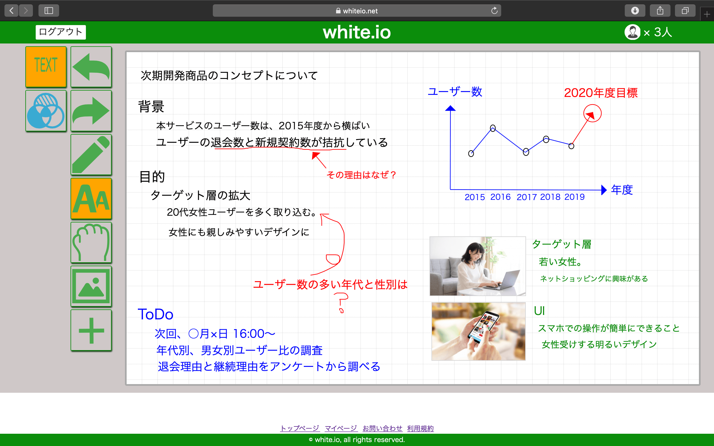
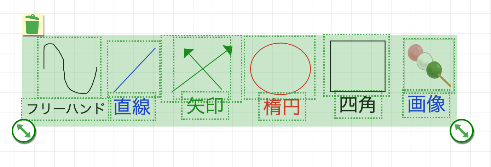
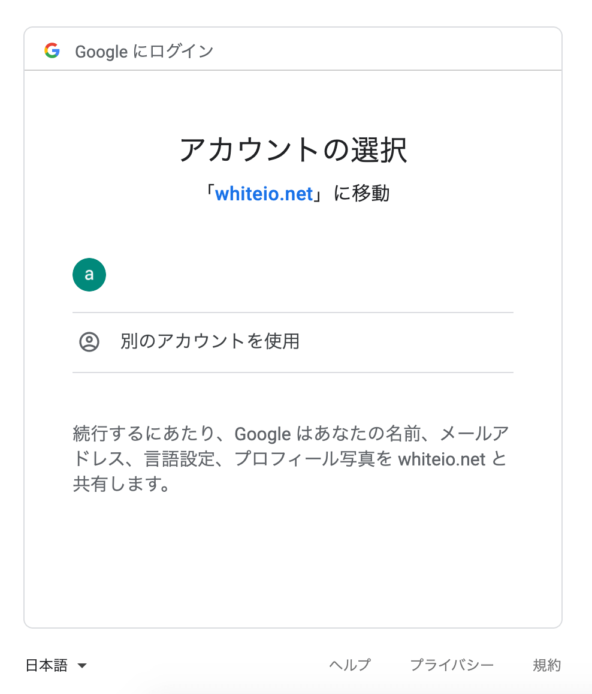
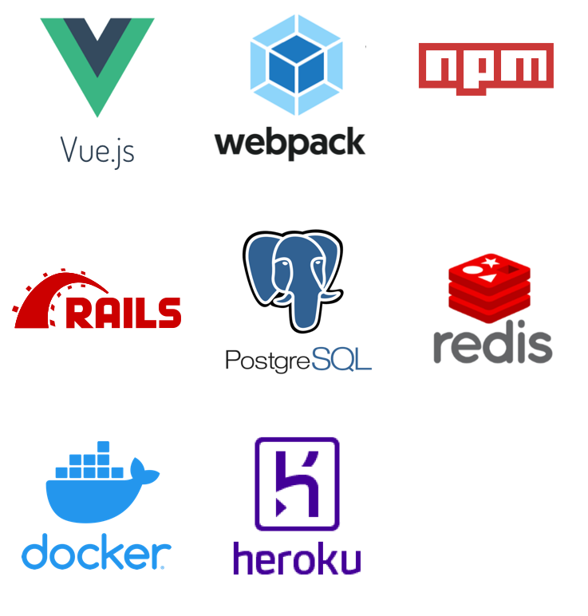

# white.io
- 共同編集可能なオンラインホワイトボード
- Bidirectional online white-board service
- サービスURL
    - https://www.whiteio.net

### 注意:
- このGitリポジトリはソースコードを一部削除しています。そのため、**クローンしても起動できません**
    - 実際のソースは、開発用のリポジトリで別途管理しています。

## コンセプト
- whiteio のコンセプトは、オンラインでチームがアイディアを出し合えるツールとなること。
- 今日、在宅勤務の増加などにより、リモートでの会議・打ち合わせが増えつつある。
    - 遠隔地にいながら、1つのホワイトボードを囲んでディスカッションをしたいというニーズが、開発の動機である。
- 本サービスは、ブレインストーミングやメモといった、アイディアを書き留める段階での利用を想定している。
    - そのため、複数人での共同編集機能をベースとし、シンプルで直感的な操作ができるUIを目指した。

    

## 実装機能
- 図形生成・編集機能
    - 曲線、矢印、テキスト、図形、画像などの描画機能
    - マウスドラッグで作図でき、拡大・移動が可能
    - テキストのフォントサイズもドラッグで変更可能

    
- 図形のグループ操作
    - 図形をまとめて移動・拡大・削除などが可能

    
- 元に戻す・やり直し機能
    - 直前の操作を戻したり、やり直すことが可能
- 共同編集機能
    - 同一の編集用URLにアクセスすると、1つのホワイトボードを複数人で共有できる
    - 他のユーザーの操作はリアルタイムで反映される
- ソーシャルログイン機能
    - Google Oauth2 でのログインに統一
    - 従来のメールアドレス&パスワード方式を排除

        
- お問合わせ機能
    - お問い合わせフォーム入力内容を管理者にメールで送信

        

## 使用技術



### フロントエンド
- Vue.JS
### サーバーサイド
- Rails
    - 共同編集機能には、Action Cableを利用
    - お問い合わせ機能には、Action Mailerを利用
- Redis
    - 共同編集時のキャッシュサーバーとして利用
        - 図形の管理
        - 参加ユーザーの管理
- PostgreSQL
    - 会員ユーザーの管理および、共有ボードの管理

### 開発・デプロイ管理
- WebPack
    - パッケージ管理はnpm
    - 開発用と本番用の環境をエイリアスで分けている
        - 開発用: `npm run dev`
        - 本番用: `npm run prod`
    - 開発時は、webpack-dev-serverを使用

- Docker
    - Rails, Redis, PostgreSQLの3つのコンテナを使用
    - ローカルフォルダをマウント
        - ローカル上のファイルを編集 -> コンテナ内のファイルに即時反映

- Heroku
    - AWS, AzureのようなPaaSのこと
    - Docker imageをHerokuにPushし、デプロイ

## 起動方法
### 開発環境での起動
- プロジェクトのルートディレクトリで
```bash:bash
    docker-compose up
    docker-compose exec web bash
```

- Railsコンテナ(サービス名: web)内で
```bash:web
    npm run dev
```
- ブラウザで `localhost:3000/`にアクセス

### 本番環境へのデプロイ
- コンテナの起動までは、開発環境と同じ
- Railsコンテナ(サービス名: web)内で
```bash:web
    npm run prod
    RAILS_ENV=production bundle exec rake assets:precompile assets:clean
```

- 下記の記事の手順を踏んで、Herokuへデプロイする。
    - [Dockerで作成したRailsアプリをHerokuにデプロイ(私の執筆記事)](https://qiita.com/NA_simple/items/57ad10717568fea2160b)

## ✉️コンタクト
- 設計・開発業務のご依頼
- その他ご質問等、お気軽にご連絡ください。
    - 中山
    - nkym.engineer.1993@gmail.com 
